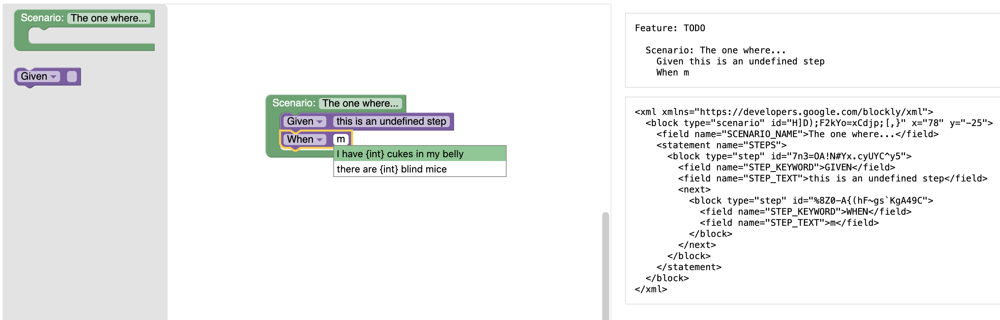
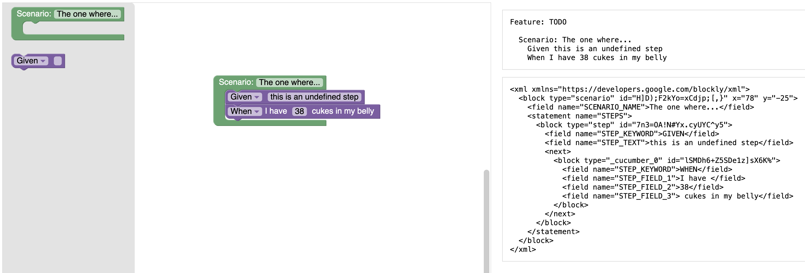

# @cucumber/blockly

This is a beginner-friendly Gherkin editor based on [Blockly](https://developers.google.com/blockly).

**The editor is experimental and not ready for production use.**

Users can drag in a generic Step block where they can change the keyword and type
to see an auto-complete of available steps.

When a step is selected from the auto-complete, the step block changes to include
smaller input fields for step parameters.

## Try it out

    npm install
    npm run start

## API

The editor is exposed as a React component. See [example/app.tsx](example/app.tsx) for sample usage.
