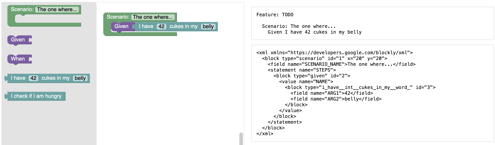

# @cucumber/blockly

This is a beginner-friendly Gherkin editor based on [Blockly](https://developers.google.com/blockly).

## Try it out

    npm install
    npm run start

## API

The editor is exposed as a React component. See [example/app.tsx](example/app.tsx) for sample usage.
